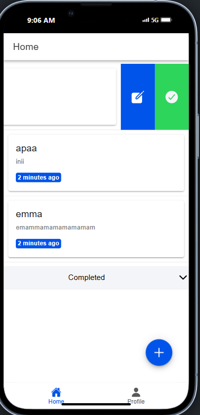

1. Proses Login 

Pada halaman login, pengguna menekan tombol "Sign In with Google", yang memicu fungsi autentikasi Google melalui Firebase dan Capacitor. Aplikasi menampilkan layar pilihan akun Google, di mana pengguna dapat memilih akun yang akan digunakan. Setelah akun dipilih, aplikasi menerima token autentikasi dari Google. Token ini diverifikasi oleh Firebase, dan informasi pengguna (seperti nama, email, dan URL foto profil) disimpan di state management menggunakan Pinia. Jika login berhasil, pengguna secara otomatis diarahkan ke halaman Home.

2. Proses di Halaman Home

Setelah login, pengguna tiba di halaman Home, yang berfungsi sebagai layar utama aplikasi. Halaman ini menampilkan nama pengguna, email, dan foto profil mereka. Foto profil ditampilkan menggunakan URL dari akun Google pengguna, dan jika gambar gagal dimuat, aplikasi menggantinya dengan gambar default. Selain itu, terdapat tombol Logout di bagian atas halaman, yang memungkinkan pengguna keluar dari aplikasi. 

3. Proses di Halaman Profile 
 
Pada halaman Profile, informasi pengguna ditampilkan secara lebih detail dan terstruktur. Halaman ini mencakup komponen untuk menampilkan nama, email, dan foto profil pengguna. Jika foto profil tidak tersedia atau gagal dimuat, aplikasi menggantinya dengan gambar default. Halaman ini juga memiliki tombol Logout, memberikan opsi bagi pengguna untuk keluar dari aplikasi. Komponen navigasi (tabs menu) mempermudah pengguna untuk berpindah antara halaman Home dan Profile.

4. Proses Logout  
Logout dimulai ketika pengguna menekan tombol Logout di halaman Home atau Profile. Tombol ini memicu fungsi logout, yang pertama-tama memutuskan sesi autentikasi pengguna di Firebase dengan memanggil fungsi `signOut`. Kemudian, sesi login Google di perangkat juga diakhiri melalui `GoogleAuth.signOut`. Setelah logout berhasil, data pengguna di state management Pinia dihapus, memastikan aplikasi tidak menyimpan informasi pengguna. Pengguna kemudian diarahkan kembali ke halaman login untuk memulai sesi baru jika diperlukan. Proses ini memastikan keamanan data pengguna dan mencegah akses tidak sah. 

LANJUTAN PART 2

Implementasi CRUD
a. Create (Menambahkan Todo Baru)
 
 
Proses:
Fungsi ini mengambil referensi ke collection todos milik pengguna yang sedang login dengan getTodoRef().
Menggunakan addDoc, data baru ditambahkan ke collection.
Timestamp createdAt dan updatedAt otomatis disimpan untuk pelacakan.
Alur:
Pengguna memasukkan data melalui form yang disediakan di modal InputModal.
Data yang dimasukkan dikirimkan ke fungsi addTodo.
Firestore menyimpan data ke dalam collection.

b. Read (Mengambil Data Todos)

  
Proses:
Fungsi mengambil referensi ke collection todos pengguna dengan getTodoRef().
Menggunakan getDocs dan query orderBy untuk mendapatkan semua dokumen dari collection dengan urutan waktu updatedAt terbaru.
Setiap dokumen dikonversi menjadi objek JavaScript untuk ditampilkan.
Alur:
Data todo diambil setiap kali halaman dimuat atau di-refresh (misalnya, pada ion-refresher).
Data ditampilkan pada halaman menggunakan v-for pada Ionic List.

c. Update (Mengedit Todo atau Status)
 
 
 
Proses (Edit Todo):
Fungsi updateTodo mengambil referensi dokumen spesifik dalam collection menggunakan doc.
Data baru diperbarui menggunakan updateDoc dengan menyertakan properti yang diubah dan updatedAt.
Proses (Update Status):
Fungsi updateStatus mengambil referensi dokumen spesifik seperti pada updateTodo.
Hanya properti status yang diubah, dan waktu pembaruan dicatat.
Alur:
Pengguna memilih todo untuk diedit melalui modal InputModal, atau mengubah status langsung di daftar (menggunakan swipe pada item Ionic).

    
d. Delete (Menghapus Todo)
 
 
Proses:
Fungsi mengambil referensi ke dokumen spesifik dalam collection todos.
Menggunakan deleteDoc, dokumen dihapus dari Firestore.
Alur:
Pengguna menghapus todo melalui gesture swipe pada item dalam daftar Ionic.
Kode:
